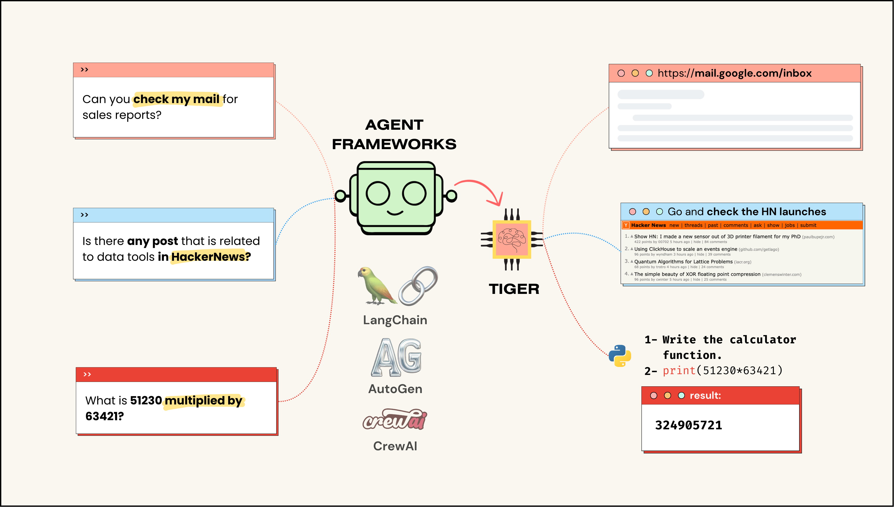
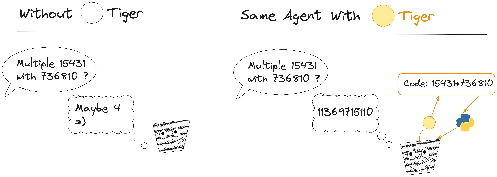
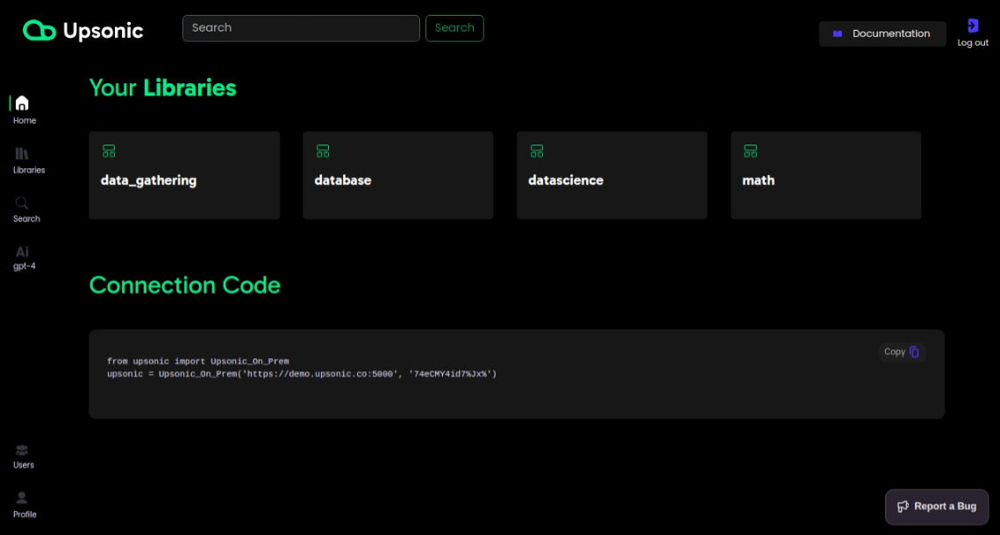
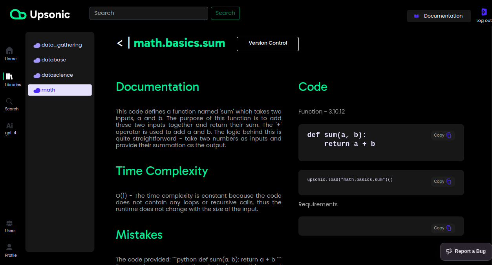

<div align= "center">
    <h1> Tiger: Neuralink for your AI Agents</h1>
</div>

<p align="center">
  <a href="#setup">Setup</a> •
</p>

<p align="center">
<b>Integrations:</b>
  <a href="#langchain-integration">LangChain Integration</a> •
  <a href="#autogen-integration">AutoGen Integration</a> •
</p>

<p align="center">
<b>Sources:</b>
  <a href="https://arxiv.org/abs/2304.08354">Currently Tools</a> •
  <a href="https://bmtools.readthedocs.io/en/main/">Custom Tools (On-Prem Docker)</a> •
  <a href="https://huggingface.co/spaces/congxin95/BMTools-demo">Public Dashboard</a> •
</p>


<br>
<div align="center">

</div>
<br>

Tiger is an community project for developing reusable and integrated tool ecosystem for LLM Agent Revolution. Tiger uses Upsonic to storing tools in isolation and automaticaly generated documents. You can create your own tiger for your agents or you can use the community maintained public and strongest Tiger 🐅.


Tiger inspired from [Neuralink](https://github.com/OpenBMB/BMTools) and and provides AI computer interface with its threads that connected to LLM interface. Tiger gives an opportunity to AI to use computer by thinking.

With Tiger your LLM agents write codes and run, uses search engines, view your calendar, use your mouse and keyboard. Saying somethink in your headphones and anythink that thinked by your agent. Tiger will transform this thinks to real actions.


In this way the Tiger project philosophy is using AI knowladge to generate action and supporting with standart infrastructures. We aim to make:

- **Utility point** for tools for agents in any framework that have function call mechanism
- **Great community for great tools** support in different technologies and sources
- **Free, Open and MIT** licenced tool library for AI agent ecosystem


<br>
<div align="center">

</div>
<br>


# Setup
Tiger projects have a general usage public library at [tiger.upsonic.co](https://tiger.upsonic.co). Its include the tools that in `tools` library. For usage this you can use the standart connection that in upsonic python library. After installing the `upsonic` library we will use the Tiger object wand integrate to your agents.

- Tiger requires equal or higher python version to 3.8

```console
pip3 install upsonic
```

## Currently Tools
We are working on Upsonic and the tools that inside the `tools` folder is sending to public tiger in each release. We are aiming to create tools without any api key and just like normal human events like searching on google with mouse, keyboard and browser.


- Interpreter
  - python

- Time
  - currently_date_time
  - time_of_an_City
  - sleep

- Search
  - Engines
    - duckduckgo

- Translate
  - eng_to_ge
  - ge_to_eng

- Hardware
  - Monitor
    - screenshot_to_file
  - Mouse
    - move_to_xy
  - Keyboard
    - send_char
  - Speaker
    - text_to_speech
  - Microphone
    - speech_to_text

If you want to add functions to public and strongest Tiger you can see to [Adding Tools](#adding-tools) section.


## Public Dashboard
For the public Tiger you can see the functions and their documentations and readmes in [tiger.upsonic.co](https://tiger.upsonic.co). You can use this place for documentation also.

**Auth**
- username: tiger
- password: tiger


<br>
<div align="center">

</div>
<br>


## Documentation of Tiger Tools
Thanks to Upsonic we just write the codes and its gives us an storage system with detailed documentation and cpu ram usage for each function. Also you can make search and use functions in your other projects with connection code.

**Auth**
- username: tiger
- password: tiger

<br>
<div align="center">

</div>
<br>

# LangChain Integration
Tiger is able to make a collabration for sharing tools with LangChain agents with this your agents will able to use Tiger functions. In this example we are asking for an multiplation question and the agent will use the tiger `interpreter.python` module and after that its write a python code and tiger will give the result in behind. With this agent will able to make mathematical operations in just two lines of code.


```python
# Geting the tiger tools about interpreter.python
from upsonic import Tiger
tools = Tiger.langchain(group="interpreter.python") # group=None for geting alls


# Generating Agent and executor with tiger tool set
from langchain_openai import ChatOpenAI
from langchain import hub
from langchain.agents import AgentExecutor, create_openai_functions_agent

llm = ChatOpenAI(model="gpt-4", api_key="OPENAI_API_KEY")
prompt = hub.pull("hwchase17/openai-functions-agent")
agent = create_openai_functions_agent(llm, tools, prompt)
agent_executor = AgentExecutor(agent=agent, tools=tools, verbose=True)


# Asking for 15231 * 64231
agent_executor.invoke({"input": "What is the result of 15231 * 64231"})

```


# AutoGen Integration
Tiger is also have a integration with AutoGen agents. You can put a tiger to your AutoGen agents. In this examples we will use the 'interpreter.python' module and with this your autogen agent able to run and view result of python codes. With this your agent will able to wait 2 second as we request.

```python
# Generating Agents with tiger tool set
from typing_extensions import Annotated
import autogen

config_list = [
    {
        'model': 'gpt-4',
        'api_key': 'OPENAI_API_KEY',
    },
]

llm_config = {
    "config_list": config_list,
    "timeout": 120,
}
chatbot = autogen.AssistantAgent(
    name="chatbot",
    system_message="For coding tasks, only use the functions you have been provided with. Reply TERMINATE when the task is done.",
    llm_config=llm_config,
)

user_proxy = autogen.UserProxyAgent(
    name="user_proxy",
    is_termination_msg=lambda x: x.get("content", "") and x.get("content", "").rstrip().endswith("TERMINATE"),
    human_input_mode="NEVER",
    max_consecutive_auto_reply=10,
)


# Geting the tiger tools about interpreter.python
from upsonic import Tiger
Tiger.autogen(chatbot, userproxy, group="interpreter.python") # group=None for geting alls


# Asking sleep 2 second
user_proxy.initiate_chat(
        chatbot,
        message="Please sleep 2 second",
    )
```

## Adding Tools

## Creating your Own Tiger


## Star History

<br>
<div align="center">


</div>
<br>